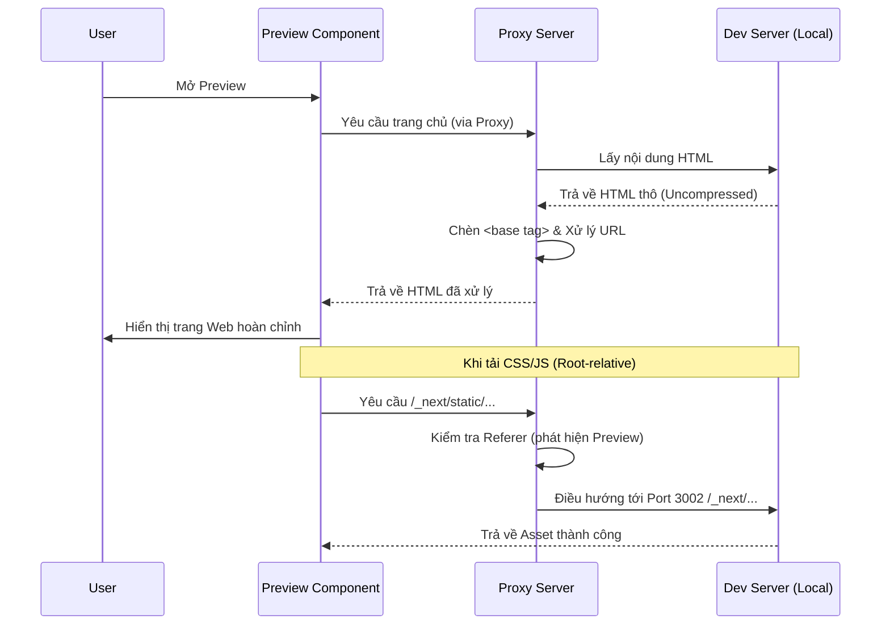

# Preview Dev Server

Tính năng Preview Dev Server cho phép người dùng xem trực tiếp kết quả của ứng dụng đang phát triển (như Next.js, Vite, React) ngay bên trong giao diện Claude-ws mà không cần chuyển sang tab trình duyệt khác.

## 1. Cơ chế hoạt động (Technical Architecture)

Hệ thống Preview được xây dựng dựa trên sự kết hợp giữa Proxy Server và kỹ thuật thao túng nội dung HTML (HTML Manipulation).

### 1.1 Proxy Server
Mọi yêu cầu xem trước được thực hiện thông qua một proxy endpoint tại `/api/preview-proxy/:port`. Khi một yêu cầu được gửi tới endpoint này, server của Claude-ws sẽ:
- Trích xuất `port` của dev server đích.
- Chuyển hướng yêu cầu tới `127.0.0.1` tại port tương ứng.
- Loại bỏ tiêu đề `accept-encoding` (ép buộc `identity`) để nhận dữ liệu thô (Raw HTML), giúp việc chèn code không bị lỗi do dữ liệu nén (Gzip).

### 1.2 Base Tag Injection
Để giải quyết vấn đề các tệp tin (CSS, JS, Images) sử dụng đường dẫn tương đối (ví dụ: `<link href="style.css">`), hệ thống sẽ tự động chèn một thẻ `<base href="/api/preview-proxy/:port/">` vào trong phần `<head>` của trang HTML trả về.
- **Tác dụng**: Giúp trình duyệt hiểu rằng mọi yêu cầu asset tương đối phải được gửi qua proxy phục vụ preview.

### 1.3 Referer Hijacking (Next.js/Vite Support)
Nhiều framework hiện đại sử dụng đường dẫn tuyệt đối (như `/_next/static/...` hoặc `/src/...`) khiến thẻ `<base>` bị vô hiệu hóa. Claude-ws giải quyết vấn đề này bằng kỹ thuật **Referer Hijacking**:
- Server kiểm tra tiêu đề `Referer` của mọi yêu cầu asset.
- Nếu `Referer` chỉ định yêu cầu bắt nguồn từ `preview-proxy`, server sẽ tự động điều hướng asset đó về đúng Port của dev server tương ứng, ngay cả khi nó không có tiền tố proxy trong URL.

## 2. Giao diện tích hợp (Integrated UI)

Giao diện Preview được thiết kế để mang lại trải nghiệm chuyên nghiệp như một IDE hiện đại.

- **Full-screen Workspace**: Preview sử dụng `React Portals` để render đè lên toàn bộ khu vực Kanban board, giúp tối đa hóa không gian hiển thị và tránh xung đột layout.
- **Device Toggles**: Hỗ trợ chuyển đổi nhanh giữa các chế độ xem:
    - **Mobile**: 375px (iPhone width).
    - **Tablet**: 768px (iPad width).
    - **Desktop**: 100% không gian khả dụng.
- **Auto-start Shell**: Khi người dùng mở Preview, hệ thống sẽ kiểm tra xem Dev Server đã chạy chưa. Nếu chưa, nó sẽ tự động thực hiện lệnh `devCommand` thông qua hệ thống Shell của Claude-ws.

## 3. Cách cấu hình

Người dùng có thể cấu hình Preview cho từng dự án trong mục **Project Settings**:
- **Dev Port**: Cổng mặc định mà ứng dụng của bạn chạy (ví dụ: 3000, 3002).
- **Dev Command**: Lệnh khởi động server (ví dụ: `npm run dev`).

## 4. Sequence Diagram (Luồng hoạt động)

## 5. Các lưu ý quan trọng
- Luôn đảm bảo dev server của bạn cho phép truy cập từ localhost.
- Nếu ứng dụng của bạn sử dụng HTTPS cứng (HSTS), preview có thể gặp vấn đề do proxy chạy HTTP.
- Proxy hiện tại ưu tiên địa chỉ `127.0.0.1` để tránh các vấn đề phân giải DNS trên Windows.
