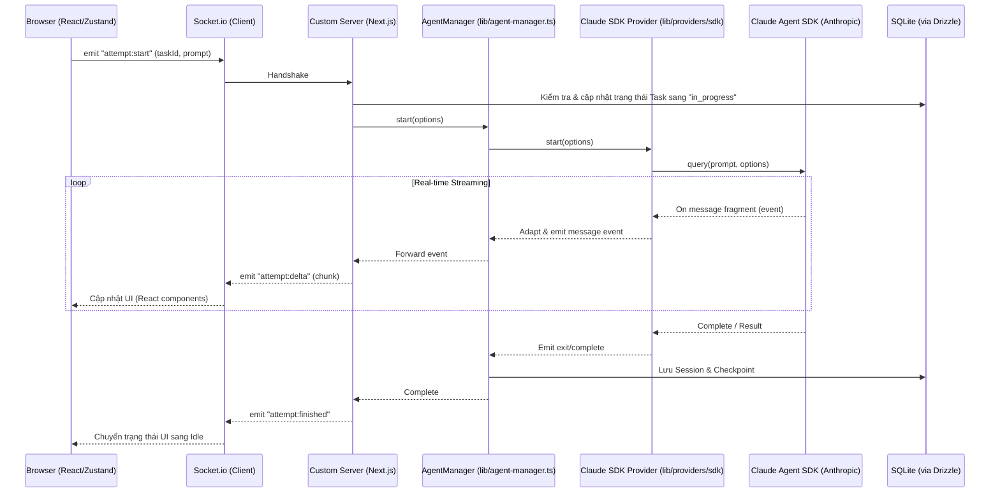

# Thiết kế Kiến trúc (Architecture) của Claude Workspace

## 🛡️ Kiến trúc Tổng thể (Overall Pattern)

**Claude Workspace (claude-ws)** sử dụng kiến trúc **Custom Next.js & Fastify Server** tích hợp với **Socket.io** và **Claude Agent SDK**.

Hệ thống được thiết kế theo các lớp (layer) rõ rệt:

1.  **Frontend (Next.js/React)**: Xử lý giao diện người dùng, biểu diễn dữ liệu thời gian thực và quản lý trạng thái tập trung (Zustand).
2.  **Socket.io Layer**: Cầu nối giao tiếp hai chiều thời gian thực giữa người dùng và các AI Agent.
3.  **Agent Orchestrator (AgentManager)**: Trái tim của hệ thống, điều phối các tiến trình Claude qua CLI hoặc SDK trực tiếp.
4.  **Provider Layer**: Cho phép linh hoạt chọn lựa giữa việc chạy Claude qua CLI (`claude-cli-provider.ts`) hoặc tích hợp SDK trực tiếp (`claude-sdk-provider.ts`).
5.  **Persistence Layer (SQLite + Drizzle)**: Lưu trữ các tác vụ (Tasks), phiên làm việc (Sessions), các điểm kiểm tra (Checkpoints) và thông tin Shell.

---

## 🏗️ Luồng xử lý Tác vụ AI (AI Task Workflow)

Sử dụng **Mermaid Sequence Diagram** để giải thích cách một yêu cầu của người dùng được gửi đi và phản hồi từ AI được xử lý thời gian thực.

---

## 🧩 Các thành phần quan trọng (Core Components)

### 1. `server.ts` (Entry Point)

Khi ứng dụng khởi động, nó tạo ra một `httpServer` tích hợp cả **Next.js Request Handler** và **Socket.io Server**. Điều này cho phép phục vụ giao diện web truyền thống đồng thời duy trì kết nối persistent cho terminal và streaming.

### 2. `AgentManager` & `Providers`

Hệ thống sử dụng **Provider Pattern** để tách biệt logic điều phối AI.

- `AgentManager`: Giữ các instance của agent đang chạy, trả lời câu hỏi `AskUserQuestion`, quản lý hủy bỏ (cancel).
- `Providers`: Triển khai chi tiết cách gọi AI tương ứng. `ClaudeSDKProvider` tải các cấu hình **MCP** từ `.mcp.json` và `.claude.json`.

### 3. `TerminalManager`

Quản lý các phiên terminal tương tác bằng `node-pty`. Nó cho phép Claude (hoặc người dùng) chạy các lệnh shell trực tiếp trong trình duyệt bằng xterm.js.

### 4. `TunnelService` (ctunnel)

Tự động thiết lập Cloudflare Tunnel nếu được cấu hình, cho phép truy cập an toàn từ xa mà không cần port forwarding.

---

## 🛠️ Quản lý API & Headless

Dự án có một thư mục `packages/agentic-sdk` là một phiên bản rút gọn của project, hoạt động như một REST + SSE API server độc lập. Điều này giúp tích hợp Claude Workspace vào các workflow CI/CD hoặc automation mà không cần giao diện người dùng.
