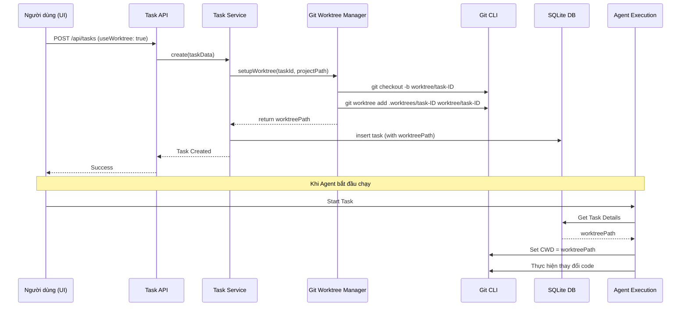

# Kiến trúc Git Worktree Manager

Hệ thống quản lý Git Worktree sẽ được triển khai dưới dạng một service trung tâm để điều phối vòng đời của các thư mục làm việc cô lập cho Agent.

## Luồng hoạt động (Sequence Diagram)

## Các thành phần chính

### 1. Cấu trúc thư mục
Các worktree sẽ được lưu trữ trong thư mục ẩn của project:
- `[Project Root]/.worktrees/task-[TASK_ID]/`

### 2. Quản lý Branch
- Mỗi task sử dụng worktree sẽ có một branch riêng (ví dụ: `agent/task-fix-bug-123`).
- Điều này giúp tránh xung đột với branch hiện tại của người dùng.

### 3. Đồng bộ hóa Agent
- `AgentManager` sẽ ưu tiên sử dụng `task.worktreePath` nếu nó tồn tại.
- Mọi công cụ (tools) của Agent như `read_file`, `write_to_file`, `run_command` sẽ được thực thi trong ngữ cảnh của worktree này.

### 4. Dọn dẹp (Cleanup)
- Khi task được xóa hoặc chuyển sang trạng thái `done`, hệ thống sẽ gọi `GWM.removeWorktree()`.
- Lệnh thực thi: `git worktree remove --force [path]` và xóa branch tương ứng.

## Ưu điểm
- **An toàn**: Code của người dùng được bảo vệ, Agent không làm hỏng workspace hiện tại.
- **Song song**: Người dùng và Agent có thể làm việc trên cùng một repo ở các folder khác nhau.
- **Dễ dàng Review**: Người dùng có thể `cd` vào thư mục worktree để kiểm tra các thay đổi của Agent trước khi merge.
